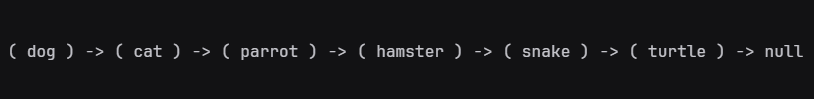

# DSA - Data Structures and Algorithms

This repository was made to keep track of what i have developed while studying one of the most important topics in Computer Science, and essential to solve problems in a GOOD way: Data Structures and Algorithms.

The order of the contents in the summary are from newest to oldest created, so if you are not familiar with most concepts and want to grasp a bit of them, i suggest you to read it from bottom to top, since some of them are dependant from each other.

## Summary

- [Balanced Binary Search Tree](#binary-search-tree)
- [Hashmap](#hashmap)
- [Linked List](#linked-list)
- [Recursion](#recursion)

## Binary Search Tree

A Binary Tree Data Structure is a hierarchical data structure where each node has at most two children, the left child and the right child. Why balanced? Keeping it balanced ensures a good performance, as it provide O(log N) time for **search**, **insert** and **delete**

[Source code](./binary-search-tree/)

<div align=center> 
  
</div>

### Features

```javascript
class Node {
  constructor(data) {
    this.data = data,
    this.left = null,
    this.right = null

    // ...Methods to manipulate nodes
  }
}
```

***

```javascript
class Tree {
  constructor(arr) {
    this.root = buildTree(arr)

    // ...Methods listed below
  }
}
```

- `insert(data)` creates a Node with the given value and inserts in the tree

- `deleteItem(data)` deletes the Node with the given data

- `find(data)` returns the node with the given data

- `height(node)` returns the height of the given node in the tree

- `depth(node)` returns the depth of the given node in the tree

- `isBalanced()` checks if tree is balanced

- `rebalance()` rebalances the tree

### Tree's Traversal methods


- Level Order Traversal (a.k.a Breadth First Search or BFS)

  - `levelOrder(callback)`

- Depth First Search or DFS

  - `preOrder(callback)`

  - `postOrder(callback)`

  - `inorder(callback)`

<div align="right">
  <a href="#dsa---data-structures-and-algorithms" style="font-weight: bold">&uarr; Back to top</a>
</div>

## Hashmap

A hashmap (or hash table) is a data structure used to implement the map, an abstract data type. A hashmap is composed of an array, where each index contains a linked list that acts as a "bucket". For setting and looking up values, it first hashes the given value, wich returns what is called a hash code. With the hash code, it jumps to the index of the array with the same value, and since it is a linked list, it's possible to realize common operations such as **search**, **insert** and **delete** entries.

[Source code](./hashmap/)

<div align=center> 
  
</div>

### Features

```javascript
class HashMap {
  constructor() {
    this.map = [];
    generateBuckets(this.map);

    // ...Methods listed below
  };
};
```

- `hash(key)` takes a key and produces a hash code

- `set(key, value)` creates an entry with a value assigned to the key

- `get(key)` returns the value that is assigned to the given key

- `has(key)` returns `true` or `false` based on wether the key is in the hash map or not

- `remove(key)` removes the entry with the given key

- `length()` returns the number of stored keys in the hash map

- `clear()` removes all entries in the hash map

- `keys()` returns an array containing all the keys inside the hash map

- `values()` returns an array containing all the values inside the hash map

- `entries()` returns an array containing all key-value pairs inside the hashmap

<div align="right">
  <a href="#dsa---data-structures-and-algorithms" style="font-weight: bold">&uarr; Back to top</a>
</div>

## Linked List

A linked list is a data structure that mainly allows efficient **insertion** **deletion** operations compared to arrays. It consists of a sequence of nodes connected by pointers or references depending on the language it is written. Each node contains a value and a pointer/reference to the next node in the list. Linked lists are more efficient for **insertion** or **removal** because the nodes are not stored continuously in memory.

[Source code](./linked-list/)

<div align=center> 
  
</div>

### Features

```javascript
class LinkedList {
  constructor() {
    this.head = createNode(null)

    // ...Methods listed below
  }
}
```

- `append(value)` adds a new node containing `value` to the end of the list

- `preppend(value)` adds a new node containing `value` to the start of the list

- `size()` returns the total number of nodes in the list

- `getHead()` returns the first node in the list

- `tail()` returns the last node in the list

- `at(index)` returns the node at the given `index`

- `pop()` removes the last element from the list

- `contains(value)` returns true if the passed in value is in the list and otherwise returns false

- `find(value)` returns the index of the node containing value, or null if not found

- `toString()` represents the LinkedList objects as strings, so you can print them out and preview them in the console, as the above image example

- `insertAt(value, index)` that inserts a new node with the provided `value` at the given `index`

- `removeAt(value, index)` that removes the node at the given `index`

<div align="right">
  <a href="#dsa---data-structures-and-algorithms" style="font-weight: bold">&uarr; Back to top</a>
</div>

## Recursion

Recursion is simply the idea of a function that calls itself. The function takes a big problem and starts breaking it down into smaller and smaller pieces ("Divide and Conquer") and continue to feed its results into the original function until some sort of answer is achieved and the whole chain stops.

[Source code](./recursion/)

### Features

### [`fibonacci.js`](./recursion/fibonacci.js)

The Fibonacci Sequence, is a numerical sequence where each number is the sum of the two numbers before it. Eg. 0, 1, 1, 2, 3, 5, 8, 13 are the first eight digits in the sequence. I wrote two functions that return an array with all the numbers in the sequence up to the given number, an iteration version and a recursive version.

#### Using iteration

```javascript
function fibs(range) {
  let sequence = [0, 1, 1];

  if (range < 0) return 0;

  for (let i = 3; i < range; i++) {
    sequence[i] = sequence[i - 1] + sequence[i - 2];
  };

  return sequence;
};
```

#### Using recursion

```javascript
function fibsRec(n) {
  const recursive = (n) => {
    if (n == 0) return [0];
    if (n == 1) return [0, 1];

    const arr = recursive(n - 1);
    return [...arr, arr[n - 1] + arr[n - 2]];
  };

  let arr = recursive(n - 1);
  return arr;
}; 
```


### [`mergeSort.js`](./recursion/mergeSort.js)

Merge sort a sorting algorithm that uses the "Divide and Conquer" approach, and can be much faster than other algorithms such as bubble sort on the right data sets. Essentially, merge sort recurses through an array of unsorted data until it reaches its smallest sub-set, a single item, and then merges the single items back togheter in sorted order.


```javascript
function mergeSort(arr) {
  if (arr.length == 1) return arr;

  let mid = arr.length / 2;
  let left = arr.slice(0, mid);
  let right = arr.slice(mid);
  
  return merge(mergeSort(left), mergeSort(right));
};

function merge(left, right) {
  let sorted = [];

  while (left.length && right.length) {
    if (left[0] < right[0]) {
      sorted.push(left.shift());
    } else {
      sorted.push(right.shift());
    };
  };

  while (left.length) sorted.push(left.shift());
  while (right.length) sorted.push(right.shift());

  return sorted;
};
```

<div align="right">
  <a href="#dsa---data-structures-and-algorithms" style="font-weight: bold">&uarr; Back to top</a>
</div>