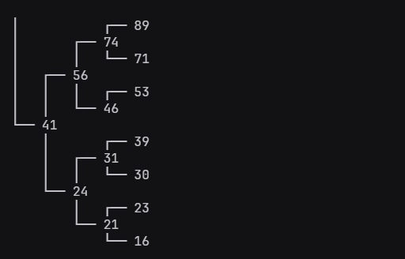
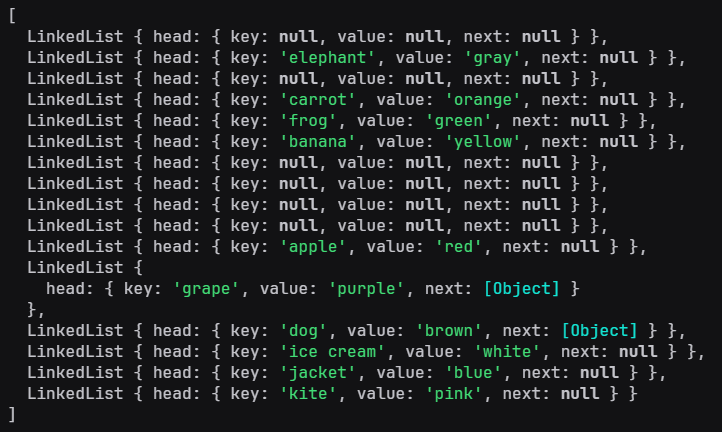

# DSA - Data Structures and Algorithms

This repository was made to keep track of what i have developed while studying one of the most important topics in Computer Science, and essential to solve problems in a GOOD way: Data Structures and Algorithms.

The order of the contents in the summary are from newest to oldest, so if you are not familiar with most concepts and want to grasp a bit of them, i suggest you to read the topics of the summary from bottom to top, since some of them are dependant from each other, such as a Hashmap and a Linked List.

## Summary

- [Balanced Binary Search Tree](#binary-search-tree)
- [Hashmap](#hashmap)
- [Linked List](#linked-list)
- [Recursion](#recursion)

## Binary Search Tree

A Binary Tree Data Structure is a hierarchical data structure where each node has at most two children, the left child and the right child. Why balanced? Keeping it balanced ensures a good performance, as it provide O(log N) time for **search**, **insert** and **delete**

[Source code](./binary-search-tree)

<div align=center> 
  
</div>

## Features

### Node

```javascript
class Node {
  constructor(data) {
    this.data = data,
    this.left = null,
    this.right = null

    // Methods to manipulate nodes
  }
}
```

### Tree

```javascript
class Tree {
  constructor(arr) {
    this.root = buildTree(arr)

    // ... Methods listed below
  }
}
```

- `insert(data)` creates a Node with the given value and inserts in the tree

- `deleteItem(data)` deletes the Node with the given data

- `find(data)` returns the node with the given data

- `height(node)` returns the height of the given node in the tree

- `depth(node)` returns the depth of the given node in the tree

- `isBalanced()` checks if tree is balanced

- `rebalance()` rebalances the tree

### Tree's Traversal methods


- Level Order Traversal (a.k.a Breadth First Search or BFS)

  - `levelOrder(callback)`

- Depth First Search or DFS

  - `preOrder(callback)`

  - `postOrder(callback)`

  - `inorder(callback)`

<div align="right">
  <a href="#dsa---data-structures-and-algorithms" style="font-weight: bold">&uarr; Back to top</a>
</div>

## Hashmap

A hashmap (or hash table) is a data structure used to implement the map, an abstract data type. A hashmap is composed of an array, where each index contains a linked list that acts as a "bucket". For setting and looking up values, it first hashes the given value, wich returns what is called a hash code. With the hash code, it jumps to the index of the array with the same value, and since it is a linked list, it's possible to realize common operations such as **search**, **insert** and **delete** entries.

[Source code](./hashmap)

<div align=center> 
  
</div>

## Features

### Hashmap

```javascript
class HashMap {
  constructor() {
    this.map = [];
    generateBuckets(this.map);

    // ... Methods listed below
  };
};
```

- `hash(key)` takes a key and produces a hash code

- `set(key, value)` creates an entry with a value assigned to the key

- `get(key)` returns the value that is assigned to this key

- `has(key)` returns `true` or `false` based on wether the key is in the hash map or not

- `remove(key)` removes the entry with the given key

- `length()` returns the number of stored keys in the hash map

- `clear()` removes all entries in the hash map

- `keys()` returns an array containing all the keys inside the hash map

- `values()` returns an array containing all the values inside the hash map

- `entries()` returns an array containing all key-value pairs inside the hashmap

<div align="right">
  <a href="#dsa---data-structures-and-algorithms" style="font-weight: bold">&uarr; Back to top</a>
</div>